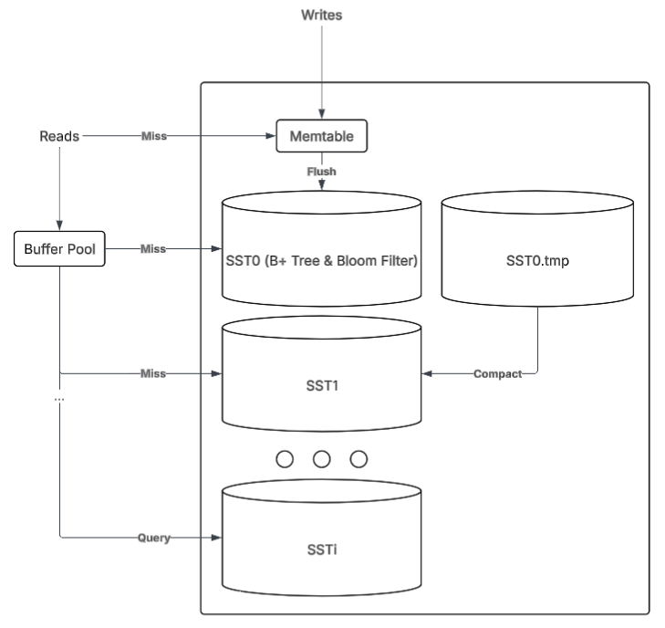

# Basalt

A high-performance LSM-Tree based Key-Value Store.

## Table of Contents

- [Architecture](#architecture)
- [Prerequisites](#prerequisites)
- [Build](#build)
- [Usage](#usage)
- [Testing](#testing)

## Architecture

<p align="center">
  
</p>

### Components

| Component | Implementation |
|-----------|----------------|
| **Memtable** | AVL Tree  |
| **SST** | B+ Tree with Bloom Filter |
| **B+ Tree** | Disk-based indexing structure |
| **Bloom Filter** | xxHash-based bit array |
| **Buffer Pool** | Extendible hash table with LRU evictions |

## Prerequisites

- Make
- GoogleTest

## Build

Build all binaries
```bash
make all
```

Run the test suite
```bash
make test
```

Remove executables
```bash
make clean
```

## Usage

Run the Basalt CLI
```bash
make cli
```

### Commands

```
┌──────────┬─────────────────────┬───────────────────────────────────────────┐
│ Command  │ Syntax              │ Description                               │
├──────────┼─────────────────────┼───────────────────────────────────────────┤
│ PUT      │ put <key> <val>     │ Insert or update a key-value pair         │
│ GET      │ get <key>           │ Retrieve the value for a key              │
│ DEL      │ del <key>           │ Delete a key-value pair                   │
│ SCAN     │ scan <start> <end>  │ Range query for keys within [start, end]  │
│ HELP     │ help                │ Show available commands                   │
│ EXIT     │ exit                │ Exit the database                         │
└──────────┴─────────────────────┴───────────────────────────────────────────┘
```

### Example

```
Welcome to BasaltDB!
Commands:
  put <key> <val>
  get <key>
  del <key>
  scan <start> <end>
  help
  exit
> put 1 100
OK
> put 2 200
OK
> put 3 300
OK
> get 2
200
> scan 1 3
1 100
2 200
3 300
Count 3
> del 2
OK
> scan 1 3
1 100
3 300
Count 2
> exit
```

## Testing

Run the available tests

```bash
make test
```

### Coverage

```
┌──────────────────────┬──────────────────────────────┬─────────────────────────────┐
│ Component            │ Test File                    │ Coverage                    │
├──────────────────────┼──────────────────────────────┼─────────────────────────────┤
│ B+ Tree              │ TestBPlusTree.cpp            │ Tree operations & traversal │
│ Disk Writer          │ TestWriter.cpp               │ Serialization & I/O         │
│ Database Core        │ TestBasalt.cpp               │ Basic CRUD operations       │
│ System Integration   │ TestSystem.cpp               │ End-to-end workflows        │
│ Bloom Filter         │ TestBloomFilter.cpp          │ Filter accuracy & FPR       │
│ Memtable             │ TestMemtable.cpp             │ In-memory operations        │
│ Buffer Pool          │ TestExtendibleBufferPool.cpp │ Memory management & LRU     │
└──────────────────────┴──────────────────────────────┴─────────────────────────────┘
```